<!-- _paginate: false -->

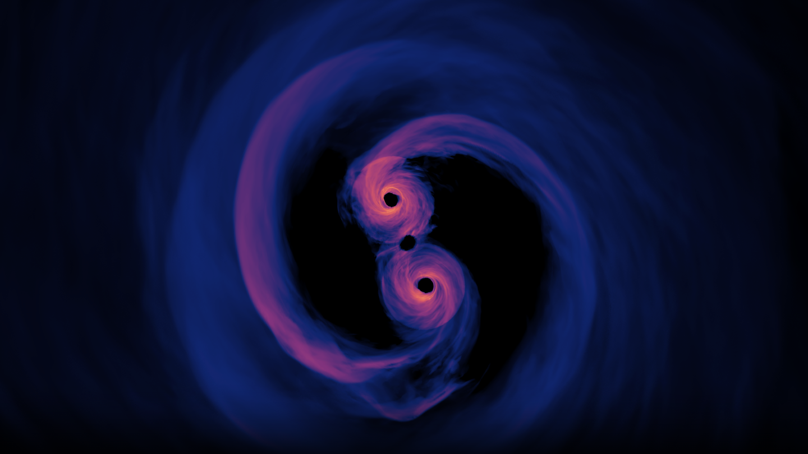

## Real-Time Gravitational Wave Detection and Source Characterization with Machine Learning

### **William W. Benoit**

Advisor: Michael Coughlin

University of Minnesota 
PhD Defense
May 27th, 2026

<!-- _footer: NASA's Goddard Space Flight Center/Scott Noble; simulation data, d'Ascoli et al. 2018 -->

<!-- 
Good morning. I'm going to be presenting the work that I've done, alongside a number of others, to apply machine learning to the problem of detecting and characterizing gravitational waves in real time.
I want to emphasize the real-time aspect: the goal of these projects from the outset was to be integrated into
production systems and produce alerts for the broader community.
-->

---

<!-- _paginate: false -->

# Part I

## Background

*Gravitational waves, detectors, and traditional methods*

<!-- To begin, I go over some foundational material: how gravitational waves arise, the basics of the hardware and software used to detect them -->

---

# General Relativity: Gravity as Geometry

**Albert Einstein, 1915:** gravity is not a force, it is the *curvature of spacetime*

- Mass and energy **bend** the fabric of spacetime
- Objects follow the straightest possible path through curved space
- What looks like gravitational attraction is really motion through curved spacetime
- As objects move, they distort the spacetime around them in a feedback loop

 

GR predicts that accelerating masses radiate energy as **gravitational waves**

<!-- 
- Rather than space being a fixed stage for physics to play out on, it is dynamic and deeply interconnected with mass and motion
- Absent a force, straightest possible path: geodesic
- Interplay between curvature and matter is what gives rise to complexity
-->

---

# Gravitational Waves: Ripples in Spacetime

When massive objects **accelerate** through spacetime, they create gravitational waves

- Propagate outward at the **speed of light**
- Two polarizations: $h_+$ (plus) and $h_\times$ (cross)
- **Transverse** (distortions perpendicular to propagation) and **quadrupolar** (stretch one axis, squeeze the orthogonal axis)

$\Delta L/L \sim 10^{-21}$ &rarr; The distance from Earth to the nearest star would change by the width of a human hair

<!-- 
plus and cross are typical polarizations, but there are others
Animation shows the effect of a gravitational wave passing into the slide on a ring of particle over one full period
Note: strain value is what we're capable of detecting 
-->

---

# Compact Binary Coalescences

The strongest astrophysical sources of gravitational waves are compact binary systems: pairs of orbiting **neutron stars** or **black holes**

 

As they orbit, the pair radiates gravitational wave energy, the orbit shrinks, the objects accelerate, and after millions of years they merge in a **fraction of a second**

 

In that fraction of a second, a merging binary radiates more energy as gravitational waves than all the stars in the **observable universe** emit as light

<!-- 
These objects start off ~millions of kilometers apart, slowly losing energy, then more rapidly

Note: stat is about luminosity, not total energy
-->

---

# Binary Merger Progression

As the two objects spiral inward, the signal passes through three phases:

**1. Inspiral**
- Frequency and amplitude both increase
- Well-described by analytical expression

**2. Merger**
- Peak luminosity briefly exceeds all stars in the observable universe
- Requires full numerical relativity

**3. Ringdown**
- Final object "rings" like a struck bell
- Oscillation at quasinormal modes

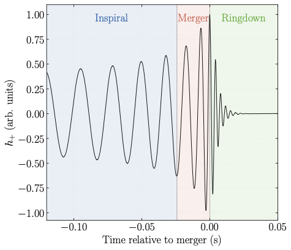

<!-- 
Inspiral phase until innermost stable circular orbit

Make sure to describe image
-->

---

# Compact Binary Detections

Three types of compact binary mergers detected so far:

| Type | Components | Count (O1–O3) |
|------|-----------|--------------|
| **BBH** | Two black holes | ~80 |
| **BNS** | Two neutron stars | 2 |
| **NSBH** | Neutron star + black hole | ~3 |

**At the close of O4:** Almost 400 total GW detections across all types

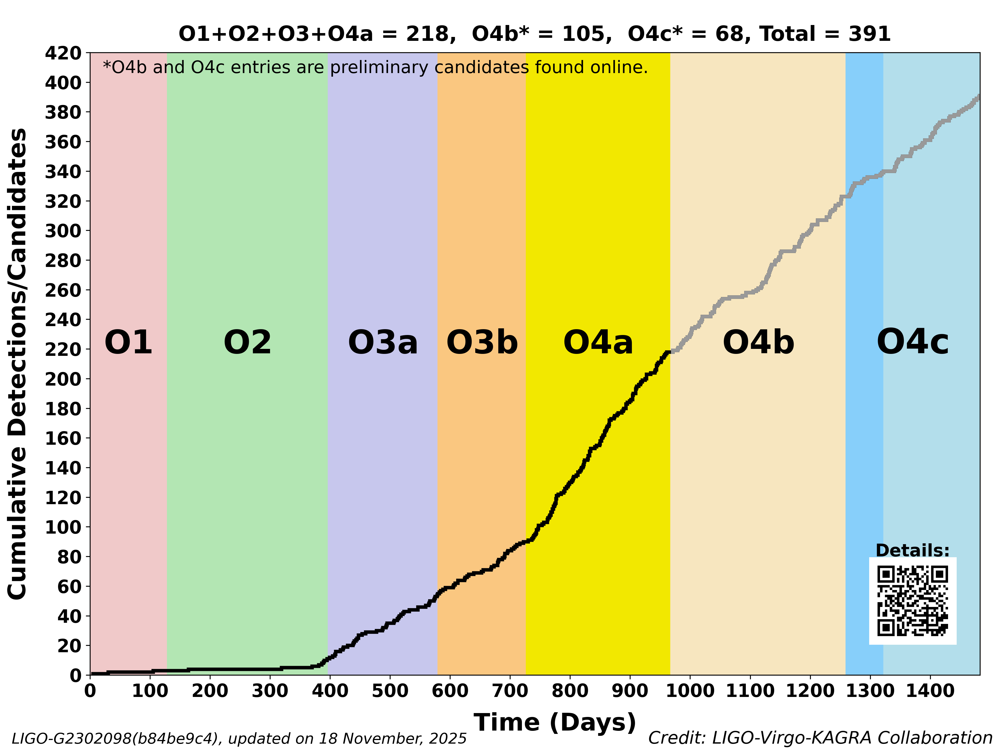

<!--
There are a couple we're not totally confident in classifying

Rate of detections increases every observing run
-->

---

# The LIGO Detectors

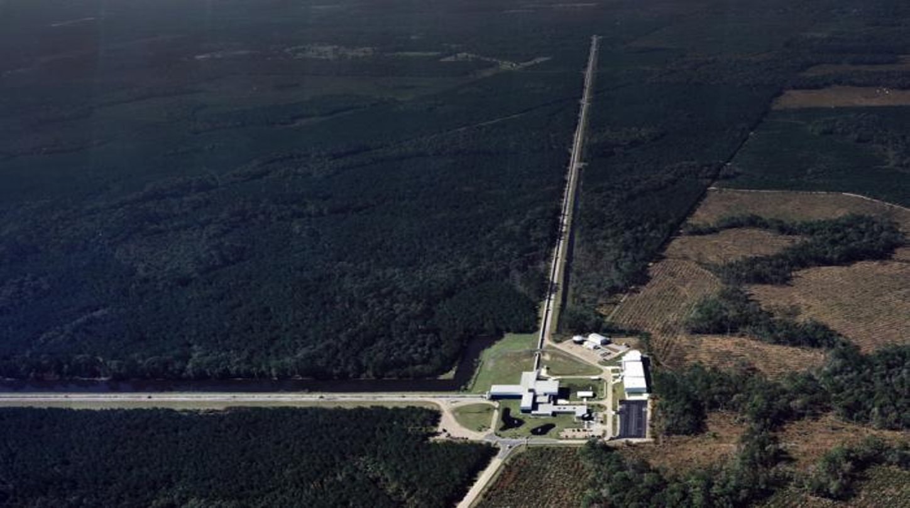

**H1** · Hanford, WA &nbsp;&nbsp;&nbsp; **L1** · Livingston, LA

**4 km** L-shaped interferometers, ~3000 km apart

- Light travel time between H1 and L1: **~10 ms**; 
sets the coincidence window
- Multiple detectors triangulate sky position from **timing, amplitude, and phase** differences
- Part of a global network: 
**Virgo · KAGRA · LIGO India**

<!-- _footer: Credit: https://www.ligo.caltech.edu/LA/image/ligo20150731a -->

<!-- 
Photo is of LLO

Pretty incredible feats of engineering

One of the largest vacuum systems on Earth (~10,000 cubic meters), second only to LHC

40 kg fused silica mirrors suspended from quadruple pendulum for seismic isolation

Mirror surface flatness ~1 nm RMS: scaled to the size of the Earth, the tallest mountain would be ~2 cm

V1 and K1 are 3 km, LIGO-India is 4 km and just broke ground last month
-->

---

# How Do We Detect Gravitational Waves?

A passing GW *stretches* one arm and *compresses* the other

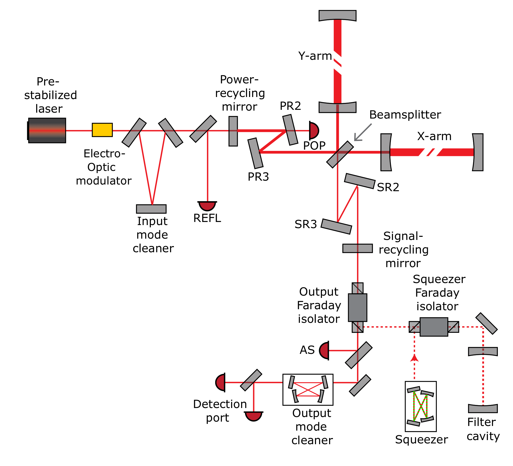

Credit: https://doi.org/10.1103/PhysRevD.111.062002

**Basic principle:**

1. Laser beam splits at a **beam splitter**
2. Each beam travels 4 km, reflects off a mirror
3. Beams recombine; normally **destructive interference** &rarr; no light
4. A GW shifts the arm lengths &rarr; **partial constructive interference** &rarr; signal

<!-- 
Reference image while talking

Number of features for signal amplification:

Fabry-Perot cavities: light bounces ~300 times per arm: effective path length ~1200 km

Power recycling mirror boosts circulating power from ~100 W input to ~200 kW inside the arms

Frequency-dependent quantum squeezing introduced in O4 to reduce shot noise at high frequencies
-->

---

# LIGO Noise and Sensitivity

The **amplitude spectral density (ASD)**: how much noise at each frequency

**Three main noise regimes:**

- **Low frequency (< 50 Hz)**
  *Seismic noise, damping controls*

- **Mid-band (50–500 Hz)**
  *Thermal, radiation pressure noise*

- **High frequency (> 500 Hz)**
  *Shot noise*

Most signals sweep through **~20–500 Hz**, right in the sensitive band of the detectors

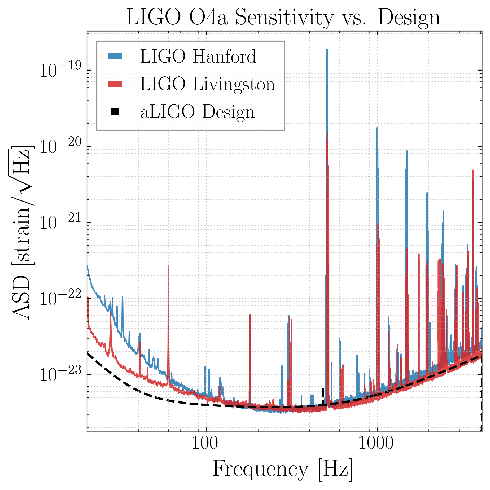

<!--
Given the scale of strain we need to detect, it's not surprising that noise is a major factor.
Instrument is designed to be most sensitive in the range of CBC signals

ASD and its square, the power spectral density, will be referenced throughout
-->

---

# Traditional Detection: Matched Filtering

**Main idea:** compute the overlap between the data and a template waveform:

$$
    \rho^2(t) = 4 \Re \int_0^\infty \frac{\tilde{d}(f)\, \tilde{h}^*(f)}{S_n(f)}\, e^{2\pi i f t}\, \mathrm{d}f
$$

- $\rho(t)$ = the **signal-to-noise ratio (SNR)**
- $d$ = detector data; &nbsp; $h$ = template
- Noise-weighted by the ASD

**When the SNR spikes:** candidate event, significance determined by peak height

**Strengths:** optimal for Gaussian noise, well-understood statistics

<!--
Now, I've never found the formula to be the most intuitive way of understanding the process.

Animation gives much better idea, <describe components>
-->

---

# The Matched Filter Template Bank

**The challenge:** we don't know which waveform is in the data

**Solution:** search with a template bank of hundreds of thousands of waveforms

- Covers masses from ~1-100 $M_\odot$
- Templates typically placed so no signal loses more than 3% SNR

**Computationally demanding:**
- Requires thousands of CPUs running in parallel
- Real-time pipelines: GstLAL, MBTA, PyCBC, SPIIR

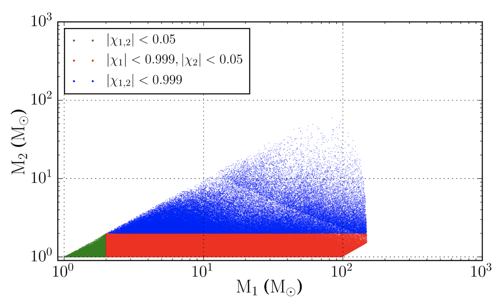

 Credit: https://doi.org/10.1103/PhysRevD.103.084047 

A neural network can detect signals **directly** from strain data, bypassing the template bank entirely

<!-- 
Ideally, we'd just try every possible waveform, but unfortunately we lack infinite computing power.
Though, if they keep building data-centers, who knows?
Instead...

Mass range covers NSs and "stellar mass" black holes - templates shown as points in image

Detection is half of the picture; after detecting, we want to know about the source system; template gives only a point estimate, and only for some parameters

-->

---

# Traditional Bayesian Parameter Estimation

**Goal:** infer the full posterior distribution $p(\theta \mid d)$ over all source parameters

 

$$p(\theta \mid d) \propto \mathcal{L}(d \mid \theta)\, \pi(\theta)$$

 

- **Posterior** $p(\theta \mid d)$: probability distribution over source parameters given observed data
- **Likelihood** $\mathcal{L}(d \mid \theta)$: how well does a waveform $h(\theta)$ match the data?
- **Prior** $\pi(\theta)$: physically motivated parameter ranges

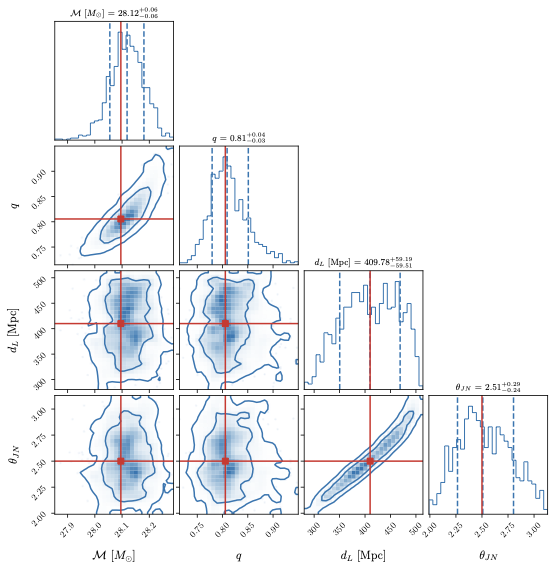

<!-- 
Make sure each term is defined

Corner plot is example of what we want to produce, showing 1D and 2D posteriors

Source parameters include masses, spins, sky location, distance, inclination, etc. 15D space. 
-->

---

# Parameter Estimation Challenges

Evaluating the likelihood $\mathcal{L}(d \mid \theta)$ at each proposed sample requires:

1. Generate template waveform $h(\theta)$ for those parameters
2. Compute noise-weighted inner product $\langle d - h(\theta) \mid d - h(\theta) \rangle$
3. Repeat $\sim 10^6$–$10^7$ evaluations to converge

**Bilby:** $\mathcal{O}$(hours)
- Each likelihood step: ~10 ms
- $10^6$–$10^7$ evaluations × 10 ms = 3–30 hrs

**BAYESTAR:** $\mathcal{O}$(seconds)
- Skips the likelihood entirely
- Requires **SNR time series**; uses relative timing/amplitude to reconstruct sky position only

A machine learning model can learn the posterior **directly** from simulated data, bypassing the likelihood evaluation entirely

<!-- 
Noise-weighted inner product = matched filtering formula shown earlier

Bilby time varies based on assumptions made for low-latency vs full

BAYESTAR doesn't generate posteriors for other parameters, and still requires the challenges of matched filtering
-->

---

# Multi-Messenger Astronomy: GW170817

## August 17, 2017

First binary neutron star + EM detection

| Time after merger | Event |
|---|---|
| 0 s | GW signal |
| +1.7 s | Short GRB |
| +11 hrs | Optical kilonova |
| +9 days | X-ray afterglow |
| +16 days | Radio afterglow |

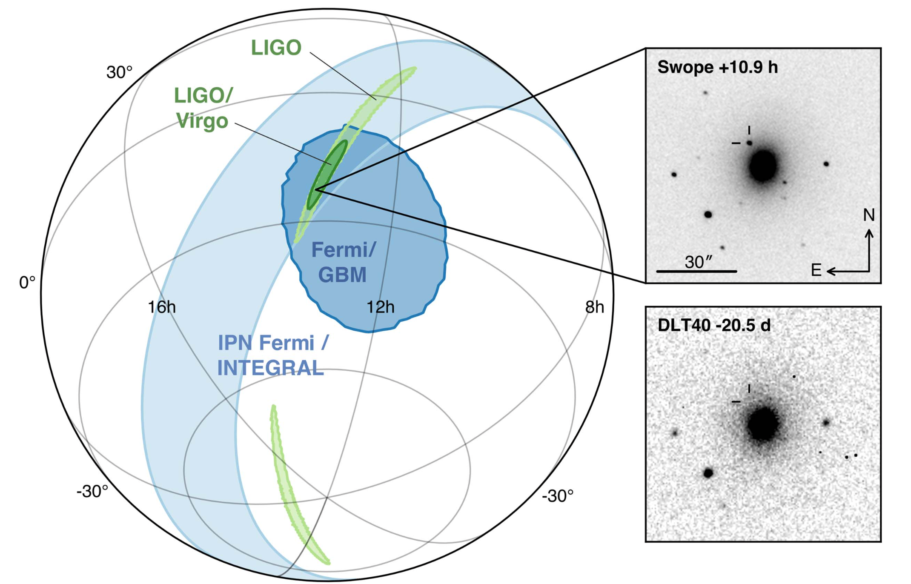

 Credit: B. P. Abbott et al 2017 ApJL 848 L12 

A single event provided the first direct evidence of BNS mergers as an origin of *short GRBs* and a site of *r-process nucleosynthesis*, plus an independent measurement of *$H_0$*

<!-- 
The motivation for solving these challenges comes from...

Briefly describe event, talk through table, point out how more detectors restricts the possible sky location.

Discuss how exciting this was scientifically

In GW170817, a glitch in L1 required manual intervention — the first 3-detector BAYESTAR skymap was not released until ~11 hours post-merger. The initial 2-detector sky map was ~190 deg², later refined to ~28 deg².
-->

---

# Making the Most of Every BNS

**Early-time EM emission from BNS mergers fades fast:**
- Blue kilonova component peaks within **~1 day** and fades rapidly
- Some models predict UV/optical emission within **minutes** of merger
- GW170817: first optical detection at **+11 hrs**

**A sky map tells observers *where* to look, but full posteriors tell them *what* to expect:**
- Inclination: on-axis jet?
- Component masses: remnant disk likely? Kilonova expected?
- Distance: how bright?

**Aframe** for robust, independent detection &nbsp;+&nbsp; **AMPLFI** for full posteriors in **seconds**

<!-- 
GW170817 was a lucky observation: only 40 Mpc away, all detectors active, observed by Fermi despite the GRB being off-axis and relatively weak.

Given the scarcity of BNSs, we don't want to rely on luck.

We've developed and deployed two algorithms...
-->

---

<!-- _paginate: false -->

# Part II

## Aframe

*ML-based gravitational wave detection*

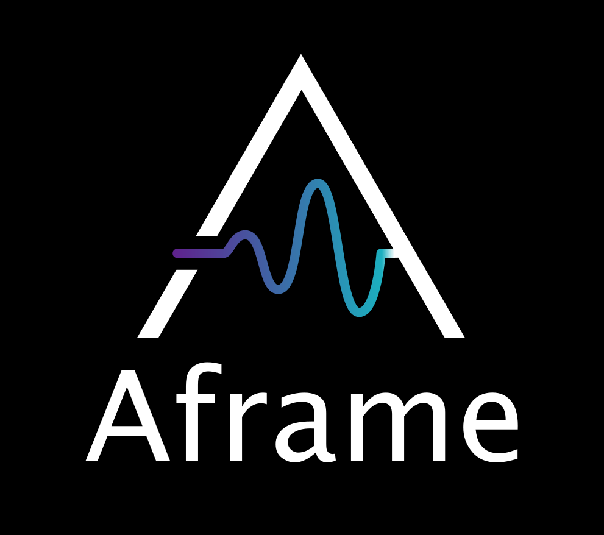

<!-- Begin with Aframe - ML model for CBC detection -->

---

# Why Machine Learning?

**For Gaussian noise, matched-filtering is optimal.**

In practice, detector data contains:
- **Glitches:** instrumental artifacts that can mimic signals
- **Non-stationarity:** noise properties change over time

**What a neural network can learn that templates cannot:**
- The structure of common glitches, and how to reject them
- Which signal features are robust across different noise realizations

Neural networks **don't assume Gaussian noise**; they learn from the data itself.
A network trained on real noise generalizes well to unseen data.

Training data is effectively unlimited: **years of background** from time-shifted detector streams, plus **millions of simulated waveforms**.

<!-- 
How does machine learning help with the challenges above?

Primarily, just go through slide here
-->

---

# Overview

**Input:** Two streams of whitened strain: 
H1 + L1, 1.5 s windows at 2048 Hz

 

**Output:** Scalar detection statistic, analogous to matched filter SNR

 

**Training:** Emphasis on diversity of training examples, implementation of efficient GPU operations for real-time augmentations

**Offline inference:**
- 4 Hz stride &rarr; one output every 0.25 s
- Analyze *timeslides* of background to establish background model
- Analyze *injection campaign* to establish sensitivity

**Throughput:** ~500 s of data per second per GPU *(V100)*. With 8 GPUs, a year of data takes ~4 hours.

<!--
I'll begin with a high-level overview of how Aframe works

Whenever I say "whitened", it just means normalized by the ASD. It bring the scale of the data from O(10^-21) to O(1).

Architecture is currently a ResNet (CNN), but the infrastructure is designed to be flexible

Define timeslides and injection campaigns
-->

---

# Training Data

**Real detector noise:**

- **~18 days** of coincident H1+L1 O3 data
- Captures real non-stationarity and glitch structure that Gaussian noise cannot
- Non-coincident windows sampled randomly &rarr; combinatorially many noise realizations

**Injected signals:**
- **100,000 BBH polarizations** (IMRPhenomPv2)
- Parameter space: $m_1, m_2 \in [5, 100]\,M_\odot$, isotropic spins
- Injected into the unwhitened noise at training time

<!-- 
18 days is just what was used for the model I'm showing results for; could be longer

One potential advantage of ML: using more accurate waveforms. MF banks don't include precession, etc.

We start with BBH because the signals are short and well-characterized.
Worked through all the technical pieces: training pipeline, data augmentation, GPU whitening, deployment. 
The same infrastructure applies directly to BNS.
-->

---

# Noise Augmentations

Noise augmentations increase the diversity of noise instances seen during training:

 

**Noise inversion** and **time-reversal** ~quadruple the number of unique noise realizations without collecting new data

 

These augmentations expose the network to more varied noise morphologies, improving generalization to unseen glitches

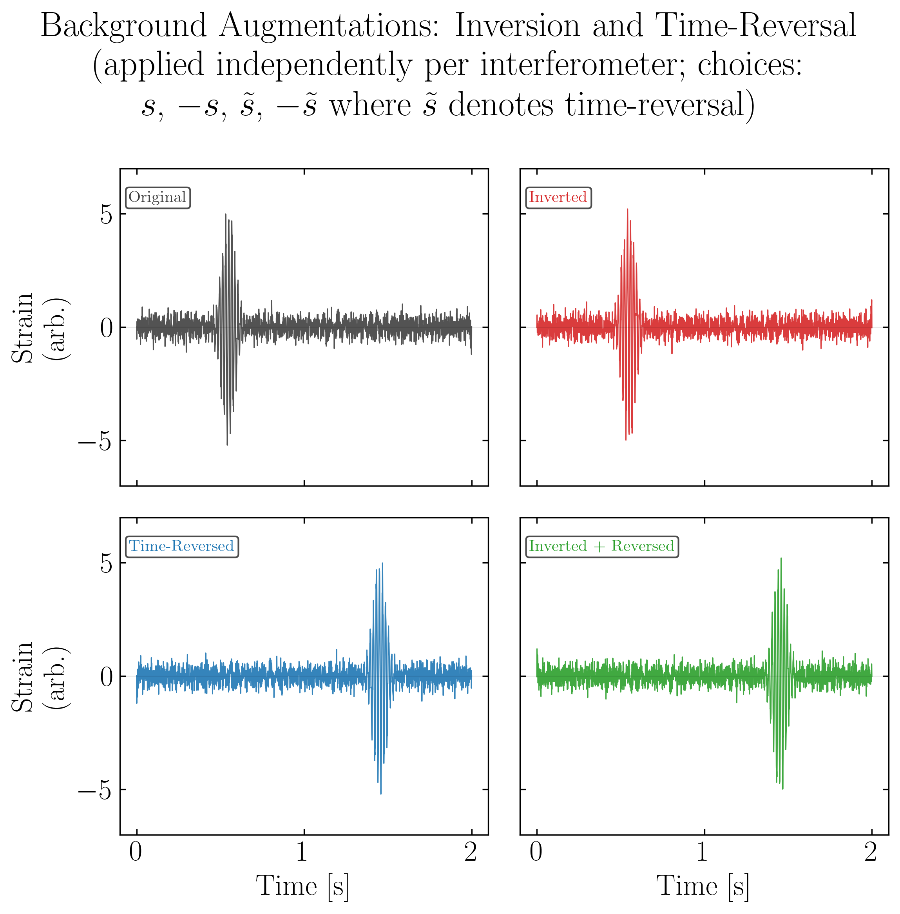

<!--
A major emphasis was placed on training the network with as much variety as possible; augmentations help with that

Image shows effect of different augmentations, though inversion may be hard to tell.
-->

---

# Signal Augmentations

**Waveform bank:** only polarizations ($h_+$, $h_\times$) are pre-computed.

At training time for each batch:

1. Sample extrinsic parameters: RA, dec, $\psi$, SNR
2. Project polarizations onto H1 and L1 **on-GPU**
3. Rescale to sampled SNR and add to noise

**Signal augmentations** encode what a real GW must look like:
- **Muting** teaches **coincidence**
- **Swapping**: teaches **coherence**

**Curriculum SNR:** start at SNR 12, taper to 4

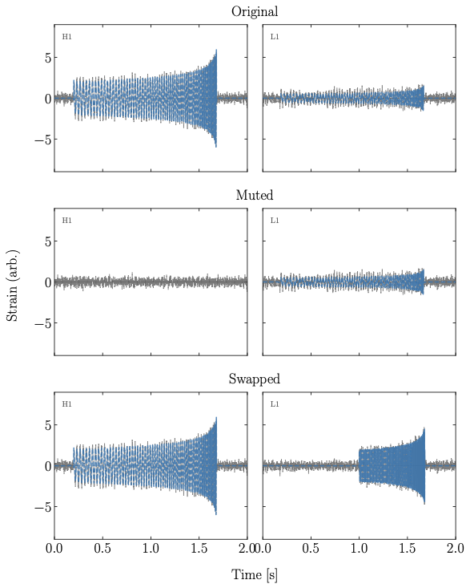

<!-- 
In addition to augmenting the background data, we also augment our signals in a number of ways.

Need to explain that polarizations are projected onto interferometer.
Projecting can change the SNR of the waveforms; rescale to desired range (amounts to linear shift in distance)

Image shows muting and swapping augmentations; note that these samples are labeled as background
-->

---

# Training Longevity

Each batch window is whitened using its **own preceding data**; ASD estimation and filtering run on-GPU, adapting to local noise conditions

**Sensitivity is maintained months post-training** with no model updates required

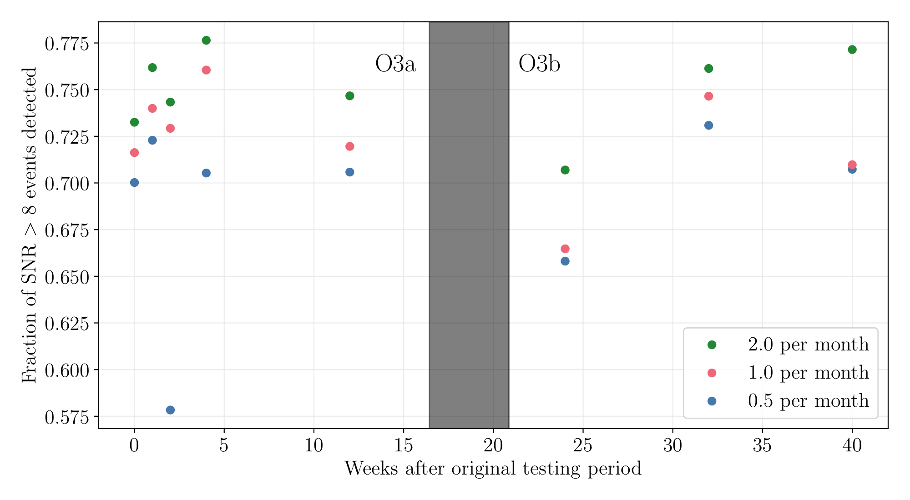

<!-- 
This property is crucial for production: we can't have our performance degrading unexpectedly, and it would be burdensome to retrain frequently.

Plot is showing the fraction of SNR 8+ events detected above a given threshold for simulated waveforms in background weeks after the original testing period.

This is the first place FAR is used; mention that it will be defined more later

This is how we train the model; how does detection work?
-->

---

# Detection Example

**Top panel:** whitened strain from H1 and L1 around GW190521_074359; the 1.5 s network window slides forward in time

**Bottom panel:** raw NN output and integrated detection statistic. The output spikes and stays high as the chirp passes through the window

The network responds to the signal across both detectors and builds a statistic analogous to matched-filter SNR

<!--
Slide text mostly does the job. Consistently high output is a result of training the model with jittered waveform
-->

---

# Measuring Significance

The network output is not directly interpretable as a FAR; estimate empirically via *timeslides*:

1. Shift one detector stream by offset greater than light travel-time
2. Real coincidences not possible &rarr; pure noise
3. Count threshold crossings to get false alarm rate in events/yr
4. Repeat to accumulate **100 years**

The background is built from timeslides at a **1 Hz** cadence.

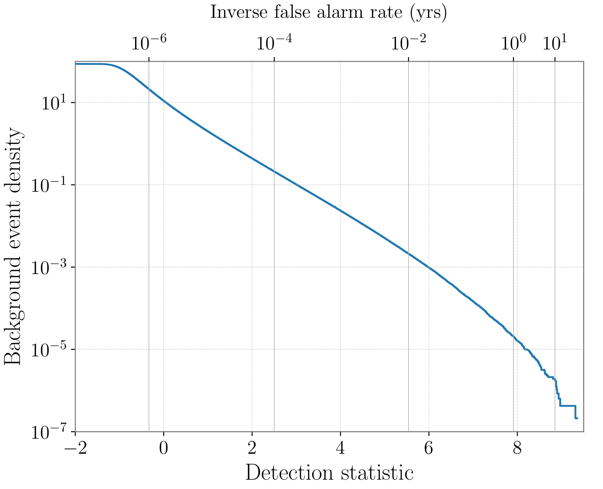

<!--
FAR = false alarm rate. Describe via the plot. After observing for a year, expect to have ~12 triggers from background noise above the FAR level of 1/month.

With this model trained and a background model estimated, we can search for gravitational waves in archival data from the third observing run, O3.
-->

---

# O3 Catalog Search: Sensitivity

**Retrospective analysis of full O3 (April 2019 &ndash; March 2020)**

- **202.4 days** coincident H1+L1 livetime
- **100 years** of background via timeslides; at 4 Hz stride, ~12 days of analysis wall-time

**Sensitive volume (SV):** how much of the universe is searched at a given FAR

- **Comparable** to GstLAL, MBTA, PyCBC for high-mass BBH
- Reduced sensitivity for $m < 20\,M_\odot$

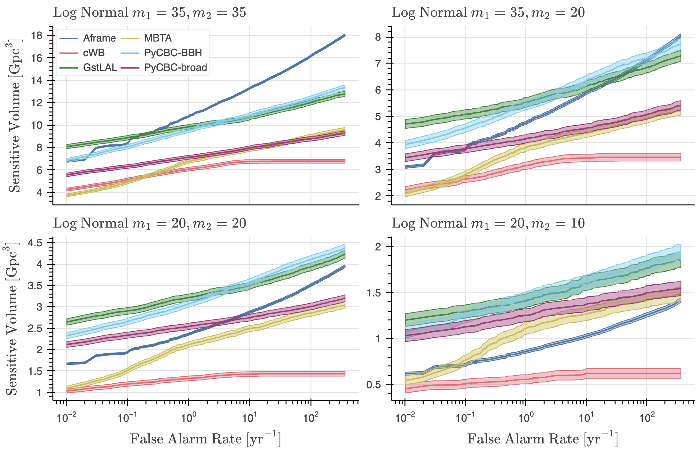

<!-- 
To begin, we can measure the sensitivity of our search against existing pipelines based on results from injection campaigns

Talk through plot

Worse at low masses, but on the other hand...
-->

---

# Higher-mass Sensitivity

At **higher** masses, Aframe's SV improves relative to matched filtering searches

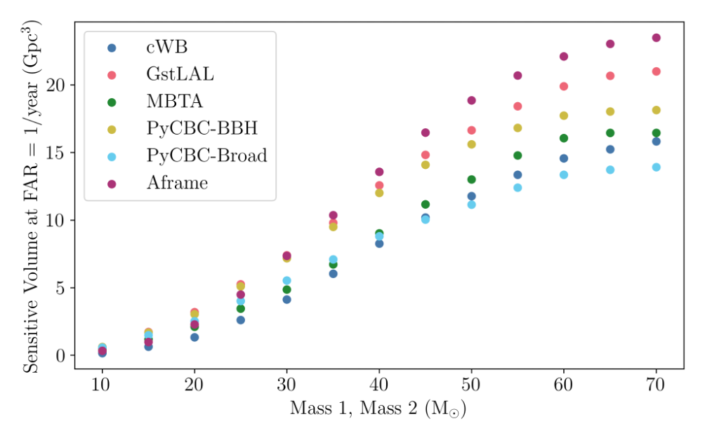

<!-- 
Note the different color and describe what this plot shows
-->

---

# $p_\text{astro}$: How Significance Is Assigned

**Definition:** probability that a candidate is astrophysical in origin

$$p_\text{astro} = p_\text{BBH} + p_\text{BNS} + p_\text{NSBH} = 1 - p_\text{terr}$$

Poisson mixture of signal and noise rates:

$$p_\text{astro}(x) = \frac{R_s(x)}{R_s(x) + R_n(x)}$$

- $x$ = Aframe detection statistic
- $R_n(x) =$ noise rate at $x$: KDE + exponential tail fit to *timeslides*
- $R_s(x) = V(x)\,r =$ signal rate at $x$: *sensitive volume* from injection campaign $\times$ *astrophysical merger rate* $r$

Aframe produces no template, so mass information is not (yet) factored in

<!-- 
p_astro incorporates source parameter information. > 0.5 used as criteria for inclusion in LVK catalog.

Don't need to take through in detail.

Contrast with matched filtering searches that use mass bins. 

Call out that p_astro = p_BBH 
-->

---

# O3 Catalog Search: Event Recovery

**38** GWTC-3 candidates recovered with $p_\text{astro}$ > 0.5

Matched-filter pipelines each found ~40-50

**3 additional** candidates from IAS/OGC catalogs

| O3 misses | Reason |
|---|---|
| 5 events | Below training mass prior |
| 10 events | Low network SNR or asymmetric detector SNR |

Misses are broadly consistent with the sensitivity curve

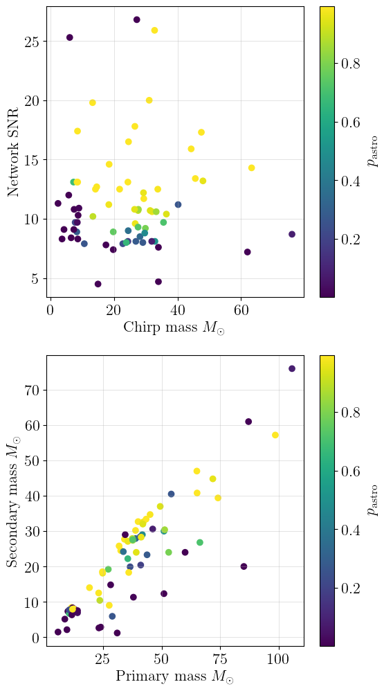

Detections work well, but we can't use BAYESTAR.
Need a PE pipeline that works from raw strain.

<!-- 
Relatively successful results. Go through text, talk through what plot shows.

Make sure to emphasize need for PE model.
-->

---

<!-- _paginate: false -->

# Part III

## AMPLFI

 
Accelerated Multi-messenger Parameter estimation using Likelihood-Free Inference

*ML-based parameter estimation*

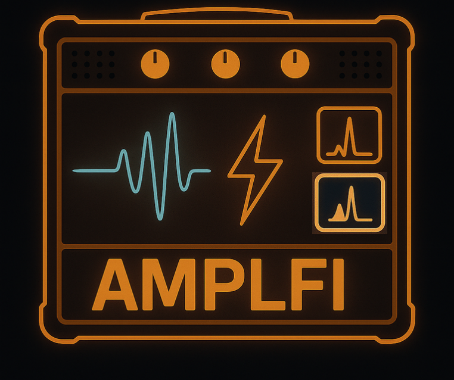

Credit: Deep Chatterjee

---

# What We Need to Characterize

Aframe detects an event; **characterization** determines the EM follow-up strategy

| Parameter | Symbol | Matched filtering | Why a posterior helps |
|---|---|---|---|
| Sky location | RA, dec | BAYESTAR sky map | Where to point telescopes |
| Luminosity distance | $d_L$ | Point estimate; degenerate with inclination | Galaxy catalog prioritization |
| Inclination | $\iota$ | Marginalized over | Jet observation probability |
| Chirp mass | $\mathcal{M}_c$ | Well-measured point estimate | Uncertainty helps with source classification |
| Mass ratio | $q$ | Weakly constrained | EM counterpart probability|

**AMPLFI** delivers all five as full posterior distributions in **< 1.5 s**

<!-- 
Public GW alerts include only the BAYESTAR sky map, p_astro, and a rough source classification.

Caveat:
Full PE posteriors for chirp mass, mass ratio, inclination, and distance are not released publicly until the catalog papers, months to years later. So, while AMPLFI produces these internally very rapidly, having these posteriors distributed publicly would require a policy change.
-->

---

# Normalizing Flows

Traditional samplers approximate $p(\theta \mid d)$ by exploring parameter space step by step. 

 

A normalizing flow learns this mapping **directly** from training data.

$$z \sim \mathcal{N}(0, I) \;\longleftrightarrow\; \theta \sim p(\theta \mid d)$$

- A flow is a sequence of **invertible neural network layers**
- Forward direction: simple &rarr; complex **(sampling)**
- Inverse direction: complex &rarr; simple **(density evaluation)**

<!-- 
Invertibility of transforms is key. Sample from simple dist (easy), transform to target. Take samples from complex dist, inverse transform to evaluate probability density

Animation shows 8 successive transforms backwards and forwards between simple Gaussian and slightly more complicated half-moon. In practice, target distribution is much higher-dimensional and much more complicated.
-->

---

# Architecture

**AMPLFI** packages a normalizing flow conditioned on GW data into a two-module pipeline:

**1. Embedding network**
- Input: whitened strain + PSD from H1, L1 (and maybe V1)
- **Dual branch:** time-domain ResNet $+$ frequency-domain ResNet; outputs concatenated
- Marginalizes over time-of-arrival
- Pre-trained via **VICReg** contrastive learning before flow training begins

**2. Normalizing flow**
- Conditioned on the data embedding
- Outputs 8-parameter posterior: $\mathcal{M}_c$, $q$, $d_L$, $\theta_{JN}$, RA, dec, $\phi_c$, $\psi$

<!-- 
Embedding network is similar structure to Aframe

Dual-branch rationale: coalescence time is easier to identify in the time domain; chirp mass (a frequency power law) is easier in the frequency domain.

VICReg: self-supervised objective that produces diverse, non-degenerate embeddings: generalizes across noise realizations and time shifts.

The inclination parameter here is $\theta_{JN}$, the angle between the total angular momentum J and the line of sight, distinct from $\iota$, which is the angle between the orbital angular momentum L and the line of sight. 
-->

---

# GPU-Accelerated Training

**Training loop, per batch:**

1. Sample source parameters $\theta \sim \pi(\theta)$ from prior
2. Generate $h(\theta)$ on-GPU (IMRPhenomPv2 in PyTorch); project onto interferometer antenna response
3. Inject into real O3 noise; estimate **local** PSD (64 s preceding each sample); whiten on-GPU; no pre-generated datasets
4. Embedding network compresses $(d,\ \text{PSD})$ to a fixed summary vector
5. Flow evaluates $\log q_\varphi(\theta \mid d)$; minimize loss by gradient descent

 

**Loss:** Negative log-likelihood: $\displaystyle\mathcal{L} = -\mathbb{E}_{\theta,\, d}\bigl[\log q_\varphi(\theta \mid d)\bigr]$

<!-- 
Training set: ~2 months of O3b science-mode strain; local PSD estimation samples diverse noise states; key enabler of model longevity. 

Otherwise, just talk through slide

Again, emphasis on GPU operations and training data diversity
-->

---

# Inference with a Trained Model

<!-- 
We can see that as the network window passes over the signal, the skymap narrows in.

Note: AMPLFI does not run in real-time; too slow. Just an example.
-->

---

# Sky Localization: Searched Area

**Dataset:** LVK O3 **Mock Data Challenge.** 1233 HL (H1+L1) and 903 HLV (H1+L1+V1) BBHs

**Searched area:** deg$^2$ a telescope must scan to find the source at a given credible level.

**Result:** AMPLFI is **competitive with BAYESTAR**; cumulative histograms agree within 2$\sigma$

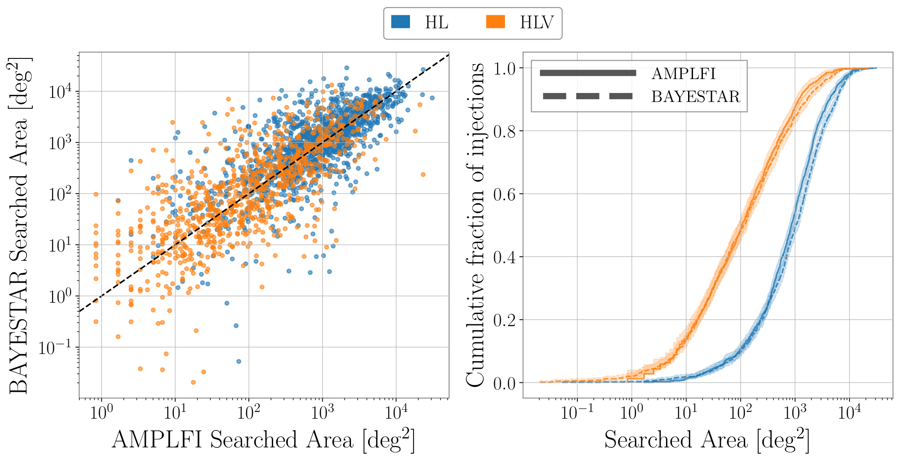

<!-- 
Talk through slide, explain dataset, image. Don't think there's much else to add.
-->

---

# Sky Localization: Searched Volume

**Searched volume:** 3D extension: sky area $\times$ distance range. *(Same MDC dataset)*

**Result:** AMPLFI provides **tighter searched volume** than BAYESTAR

For events with EM counterparts, a tighter volume means fewer candidate host galaxies

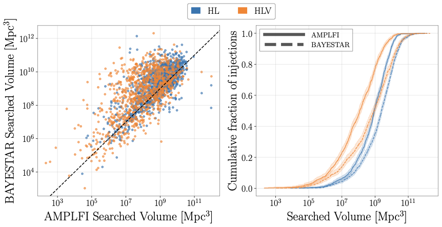

<!-- 
Same deal as previous

AMPLFI infers sky position and distance jointly; 
BAYESTAR fits distance per-pixel as a post-processing step. 
The remaining conditional posterior probability for the luminosity distance along a specific line of sight is approximated using an ansatz
-->

---

# Chirp Mass Recovery

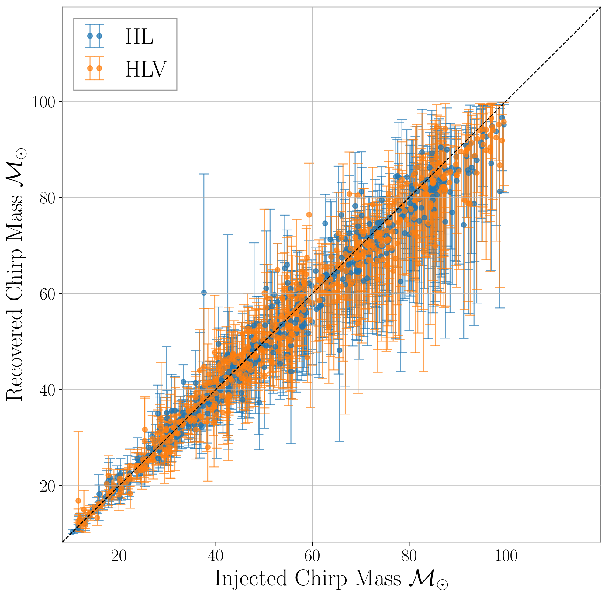

Orange: HL network · Blue: HLV network  
Error bars: 5th–95th percentile of posterior *(same MDC dataset)*

**Result:** 
- Recovery is **accurate** across $\mathcal{M}_c \in [10, 100]\,M_\odot$.
- Scatter increases at higher masses as shorter signals carry less inspiral phase information

<!-- 
Crowded plot, but the main point is that chirp mass estimation for O3 MDC is good.

Matched filtering pipelines provide only a point estimate - no error bars.
-->

---

# Posterior Calibration

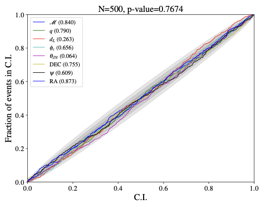

**PP-plot:** for each injection, compute the percentile rank of the true parameter under the AMPLFI posterior. 

- If the posterior is correct, this is **uniformly distributed**
- Shaded bands: 1, 2, 3$\sigma$ expected scatter from 500 finite samples 
- Computed across 500 injections drawn from the training prior

All parameters show uniform coverage &rarr; AMPLFI posteriors are **unbiased**

<!-- 
Don't need to spend too much time here; briefly explain plot and that posteriors for measured parameters are unbiased.

Keep in mind for questions: evaluating on samples not drawn from training prior will generally not be unbiased.
-->

---

# Posterior Samples: Real O3 Events

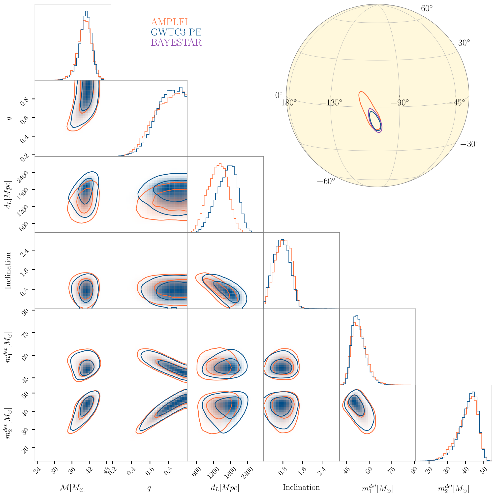

**8 GWTC-3 events** analyzed: 5 HLV + 3 HL network

- Posteriors in **broad agreement** with GWTC-3 PE (blue) and BAYESTAR (purple). 
- Masses and sky position well-recovered
- **GW200224_222234:** clean agreement across all parameters

<!-- 
Selection criteria: (1) p_astro > 0.5; (2) parameters within AMPLFI training prior (Mc 10–100 Msun, distance within prior); (3) occurred during or after AMPLFI's training period (O3b onward); (4) no glitch mitigation required. 

In general, don't expect AMPLFI to be as tightly constrained as bilby.

Three additional distance-railing events (GW200220, GW200128, GW191222) were analyzed separately. Sky maps and masses in rough agreement with GWTC-3, but distance posteriors hit the prior boundary. 

Some other events do not show as good of agreement. Differences vs GWTC-3 PE arise from: different waveform (IMRPhenomPv2 vs IMRPhenomXPHM — no higher modes), insufficiently trained model, AMPLFI uses low-latency data. -->

---

# Model Longevity

**Testing Set:** ~500 injections (SNR ≥ 12) at 0, 4, 9, and 11 weeks post-training 

Evaluate P-P tests (left) and searched area (right)

**Result: no degradation over 11 weeks.** All four epochs within error bands.

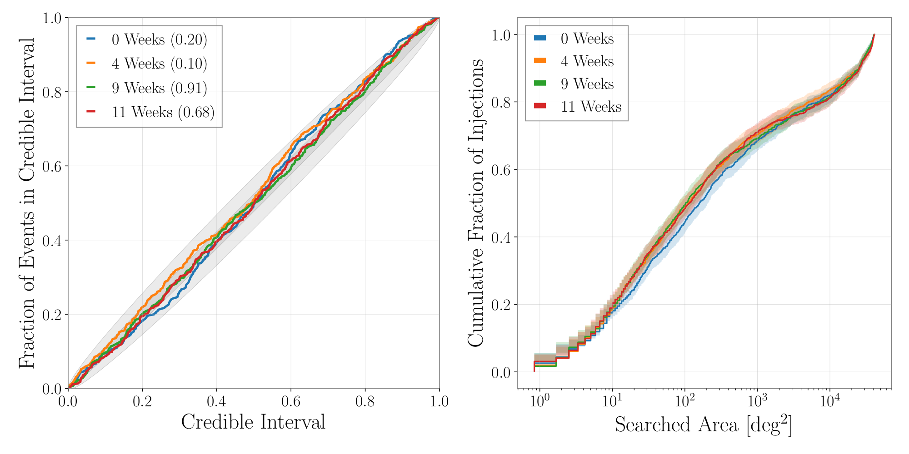

<!-- 
Just like with Aframe, we care about the longevity of AMPLFI, and we find that it's stable for months.
-->

---

<!-- _paginate: false -->

# Part IV

## Online Deployment

*End-to-end production pipeline in LIGO O4c*

<!-- 
With this set of results, these models are production-capable.

Now we need the deployment infrastructure.

I'll discuss how we set up the real-time analysis and present public results from O4c, the third part of the fourth observing run.
-->

---

# Overview

End-to-end production pipeline deployed **August &ndash; November 2025** (LIGO O4c)

**First ML-based CBC detection pipeline deployed in LVK production during a live observing run**

**Hardware:** Single **NVIDIA A30 GPU**
- Aframe + AMPLFI co-deployed on shared GPU memory
- No expensive cluster: one node handles everything

**Integration:**
- GraceDB (LVK alert database)
- Annotation pipelines
- Real-time human oversight and vetting

<!-- 
I'll begin with an overview before moving into the more technical details
-->

---

# Main Search Process

Single **NVIDIA A30 GPU** runs Aframe + AMPLFI. **~11 s** from merger to upload.

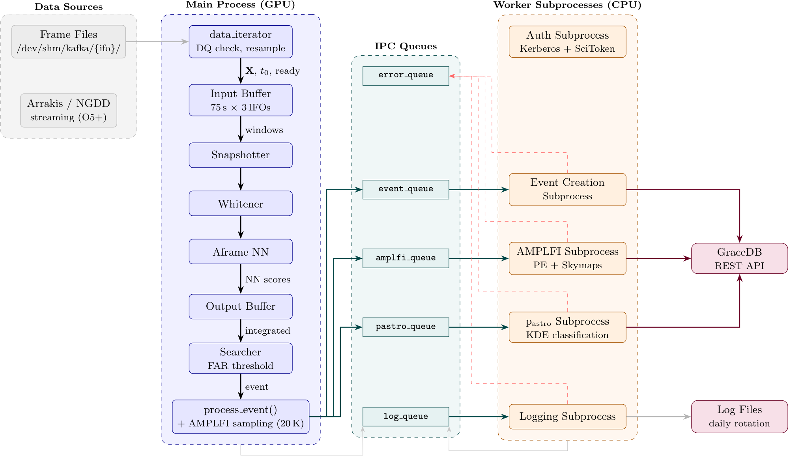

<!-- 
This slide and the following one have some fairly complicated diagrams; I won't go through each element, but I want to give a sense of the flow of data.

We start with data-loading on the left, and end with event submission on the right.

Main process owns the GPU exclusively: loads frames, resamples, validates DQ flags, maintains 64 s GPU buffer for PSD estimation, runs Aframe, then hands trigger time to AMPLFI. 

Subprocesses, discussed further on the next slide, handle tasks in parallel wherever possible to cut down on latency.
-->

---

# Subprocess Communication

**Design goal:** each sub-process starts the moment its upstream data is available

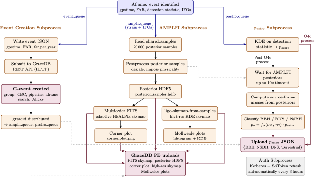

<!-- 
We wanted each subprocess to kick off as soon as possible so that information can reach GraceDB as soon as possible.

Once the main process identifies an event, in parallel:
- The event is submitted with FAR and GPS time
- AMPLFI's posterior samples are used to compute low-latency data products and submitted to graceid returned by event process
- p_astro is calculated based on detection statistic and submitted once graceid is returned from event submission (in the future, this will incorporate source info from AMPLFI)
-->

---

# Dual Inference Modes

**Significance (4 Hz)**
- Compared against timeslide background for FAR
- Threshold crossed &rarr; trigger upload to GraceDB

**Timing (512 Hz)**
- $128\times$ finer time resolution: < 2 ms per step
- Used **only** to estimate merger time
- Feeds precise trigger time to AMPLFI

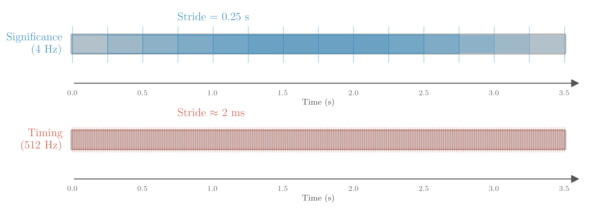

<!-- 
One challenge we had to solve that was distinct from the offline case 

Evaluating FAR using the 512 Hz statistic created events 6 times too often.  The 512 Hz distribution of detection statistics differs from the 4 Hz timeslide background used to set the threshold. 
-->

---

# Headline Results

**24 CBC candidates** with H1-L1 data available during O4c

23/24
detected above low-significance threshold (96%)

19/24
above public alert threshold (79%)

9
events where Aframe was preferred at the time of alert 

- 1 non-detection: **power outage** at detector site
- AMPLFI sky maps distributed via GCN for the **9 preferred events**
- Participated in the **first CBC discovery by a neural network** in LVK production
- Duty cycle and FAR requirements met throughout O4c
- Monitored pipeline health and validated events throughout the run

<!-- 
This can just be read through

"Preferred at the time of preliminary alert"
-->

---

# Aframe and AMPLFI in a Real Alert

**S250830bp:** a real O4c CBC candidate

- Found by Aframe (and 7 other pipelines)
- FAR: $3.2 \times 10^{-10}$ Hz $\approx$ **once per 100 years**
- Aframe's detection was the first to reach GraceDB
- AMPLFI sky map distributed via GCN within **~24 seconds**

GCN Circular 41606 is the second time an ML pipeline triggered a preliminary alert &mdash; the first was also us, earlier that day.

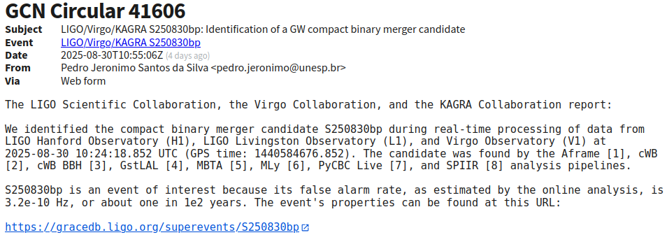

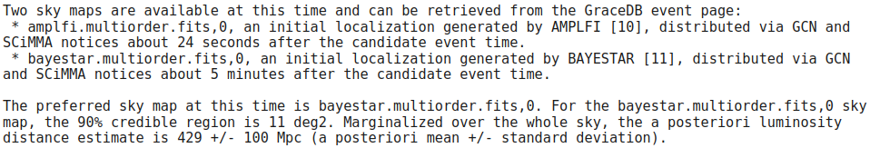

<!-- 
Read through all the points

Note that this was a high-significance event due to AMPLFI's sky localization
-->

---

# Example Sky Maps

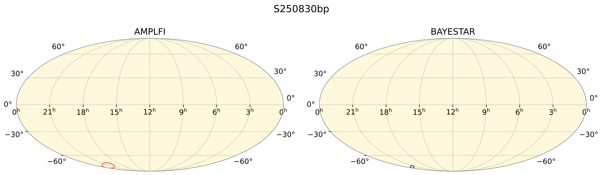
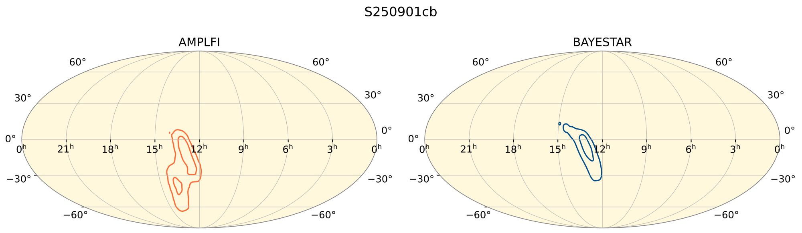

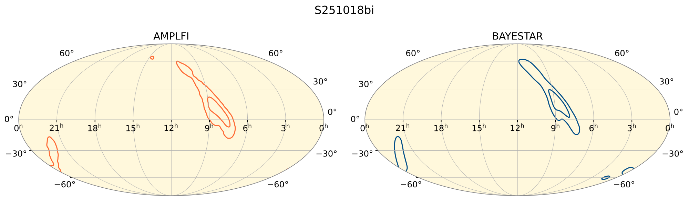
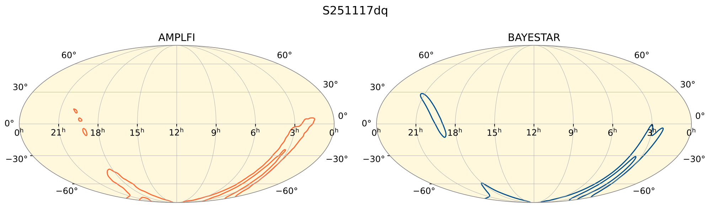

 

In addition, Aframe + AMPLFI deliver **full posteriors** over ($\mathcal{M}_c$, $q$, $d_L$, $\theta_{JN}$, sky) in the time matched-filter pipelines take to produce a sky-position-only alert and orders of magnitude faster than Bilby PE (tens of minutes to hours)

<!-- 
Found a highly constrained skymap: high significance alert (corresponds to example above)

50% and 90% areas are sometimes smaller or larger than Bayestar 
-->

---

# Summary of Developments

### Aframe

- State-of-the-art ML GW detection
- Competitive with matched filtering for high-mass BBH
- Full O3 search: **38 GWTC-3** candidates + **3** from IAS/OGC catalogs
- Detected **all possible** CBCs while live

### AMPLFI

- **~1.5** second Bayesian PE
- Sky localization competitive with BAYESTAR
- Calibrated posteriors consistent with Bilby on GWTC-3
- **9 GCN alerts** distributed during O4c

### Infrastructure

- GPU-native, real-noise training
- On-GPU waveform generation
- End-to-end tested and deployed at scale
- `ml4gw`: open-source library for GW ML
- Open-source **foundation** for future GW detectors

<!-- 
Just discuss, no need for much detail here

Connect bullet points with commas when speaking

Stress important of infrastructure for future developments
-->

---

# Limitations & Future Work

## Current Limitations

**Aframe:**
- Reduced sensitivity for $m < 20\,M_\odot$
- No BNS/NSBH support yet
- Two-detector only (H1 + L1)

**AMPLFI:**
- Posteriors broader than Bilby per event
- No BNS/NSBH support yet
- Posteriors unreliable outside prior range (very distant, very massive)

## Future Directions

**Near-term:**
- *Heterodyning:* compress long signals
  &rarr; enable BNS/NSBH support
- *Latency reduction:* NN-based merger time prediction, causal whitening
- *Importance sampling:* sharpen AMPLFI posteriors
- Multi-detector support for Aframe

**Long-term:**
- Early-warning search development 
- ML methods *essential* for high event rate of next gen detectors

<!-- 
Just discuss, no need for much detail here
-->

---

# Acknowledgments

## Advisor: Michael Coughlin
### Committee: Nadja Strobbe, Vuk Mandic, Michael Wilking, Ray Liu

**Colleagues and Mentors:** 
Ethan Marx, Deep Chatterjee, Alec Gunny, Erik Katsavounidis, Phil Harris 
The ML4GW team
The UMN gravitational wave group

**Family:** Jess, Mom, Dad, Peter

**Funding & Computing:** NSF PHY-2117997 &nbsp;·&nbsp; NSF PHY-2308862 &nbsp;·&nbsp; NSF PHY-2409481
LIGO Laboratory &nbsp;·&nbsp; LIGO Data Grid &nbsp;·&nbsp; NCSA-Delta

<!-- 
Before I take questions, there are a number of people I need to thank.

First, my advisor Michael Coughlin, who has been an incredible mentor throughout my PhD and guided me in a way that made the process as stress-free as I think is possible. I've learned so much from working with you.

I also want to thank my committee — Nadja Strobbe, Vuk Mandic, Mike Wilking, and Ray Liu — for taking the time to review my work and for being here today. In particular, I want to thank Vuk for welcoming me into the group when I first started, and for continuing to provide guidance in the years since.

Next, the people I've worked with most closely: Ethan Marx, Deep Chatterjee, and Alec Gunny. All of these projects have been highly collaborative, and I couldn't have asked for better teammates. It would not have been possible without all of you.

I also want to thank Erik Katsavounidis and Phil Harris for their mentorship and for the opportunities they've provided me over the years. More broadly, it's been genuinely exciting to help build something with the ML4GW team, and I'm looking forward to continuing to work on it in the future. 

And to the group here at UMN: I'm sad to be leaving, but I appreciate the discussions I've had and the time I've spent here with you all.

Finally, I want to thank my family: my partner Jess, who has supported me since I first started my grad school applications; and my mother, father, and brother Peter, who have encouraged me every step of the way.

With that, thank you for your time, and I'll be happy to take any questions.
-->

---

# Thank You

**Questions welcome**

<!-- -->

---

<!-- _paginate: false -->

# Back-up

---

# Back-up: Parameter Estimation for O3 New Candidates

**3 significant candidates not in GWTC-3**, each first reported by an independent catalog:

| Event | Catalog | Key finding |
|---|---|---|
| GW190707_083226 | IAS | Broadly consistent; luminosity distance wider |
| GW190818_232544 | IAS | High $\chi_\text{eff}$; spin posteriors in close agreement |
| GW200106_134123 | OGC | Close agreement across all parameters |

**Method:** Bilby with IMRPhenomXPHM, 2000 live points — matching the methodology of the respective catalog analyses

Mass, spin, and sky localization posteriors confirm astrophysical origin and are broadly consistent with independent results

These offline results are being prepared for contribution to **GWTC-7**

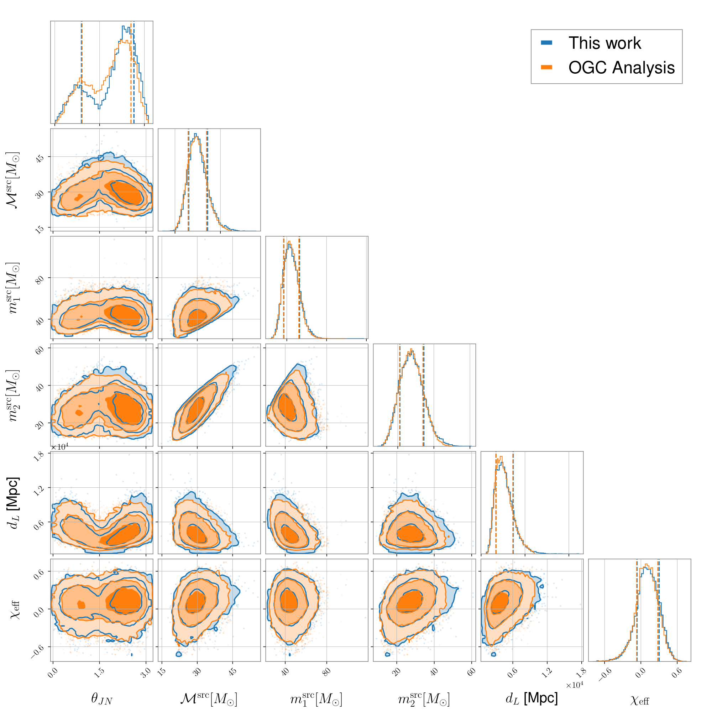

<!-- -->

---

# Back-up: IAS New Candidates

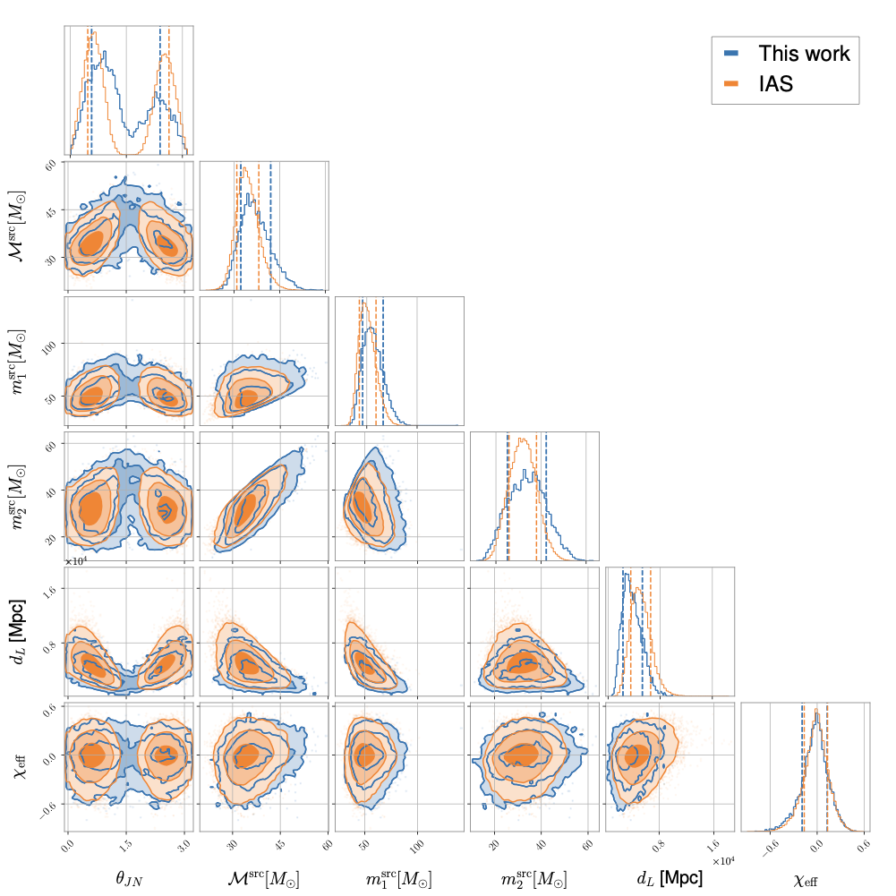

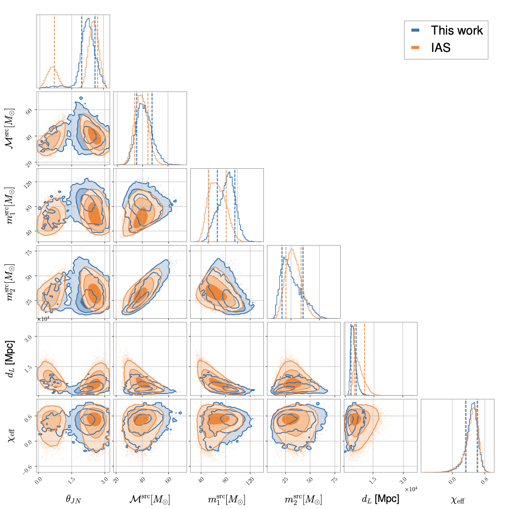

<!-- -->

---

# Back-up: AMPLFI Posteriors — GW191215 & GW200311

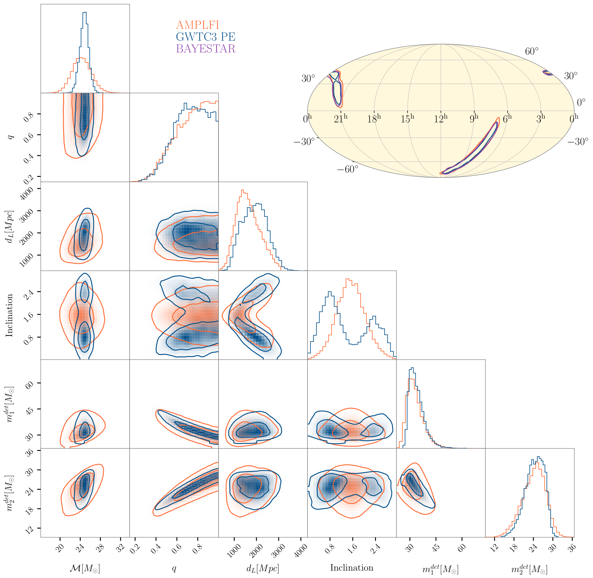

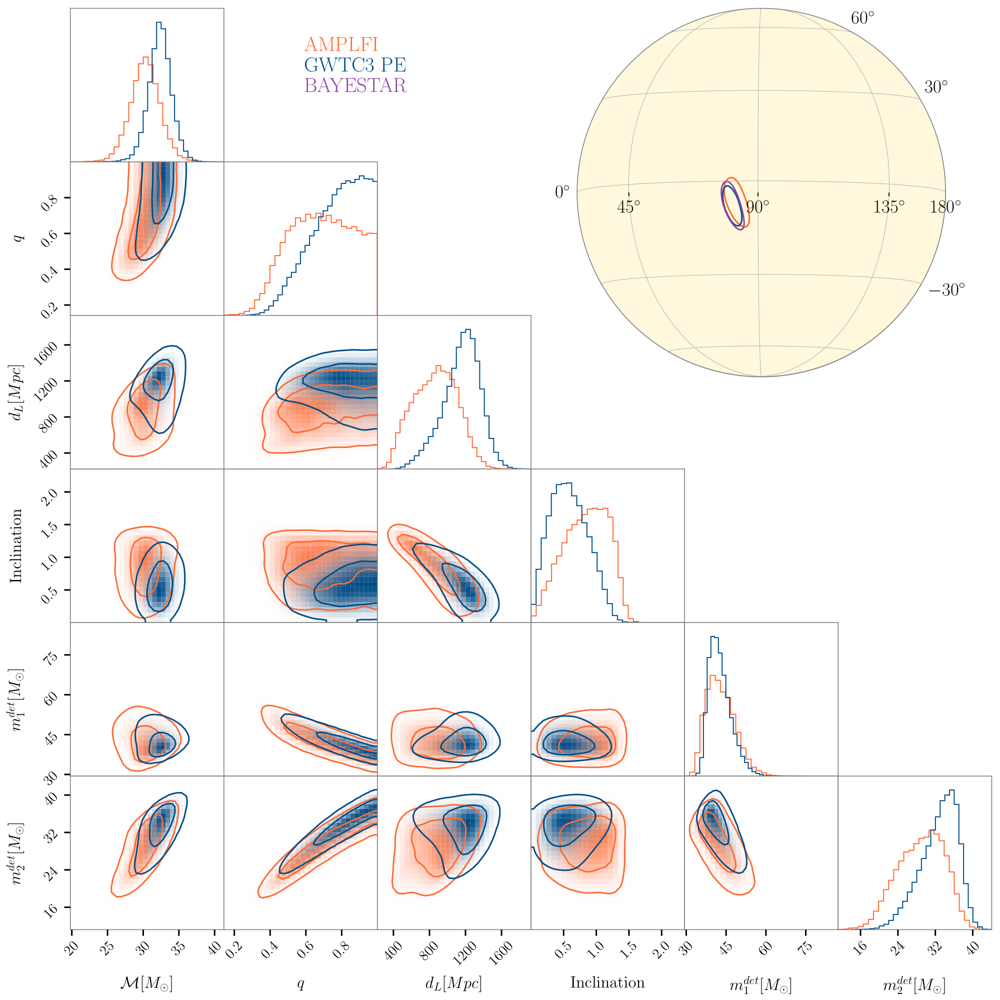

<!-- -->
